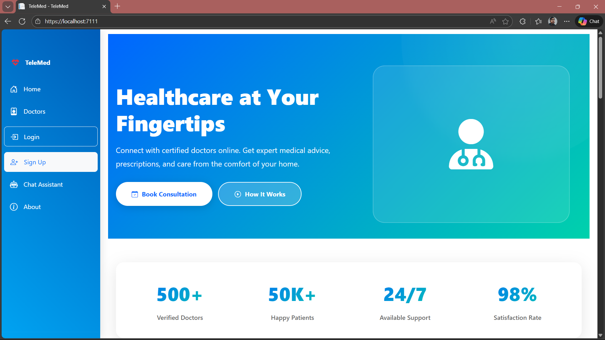
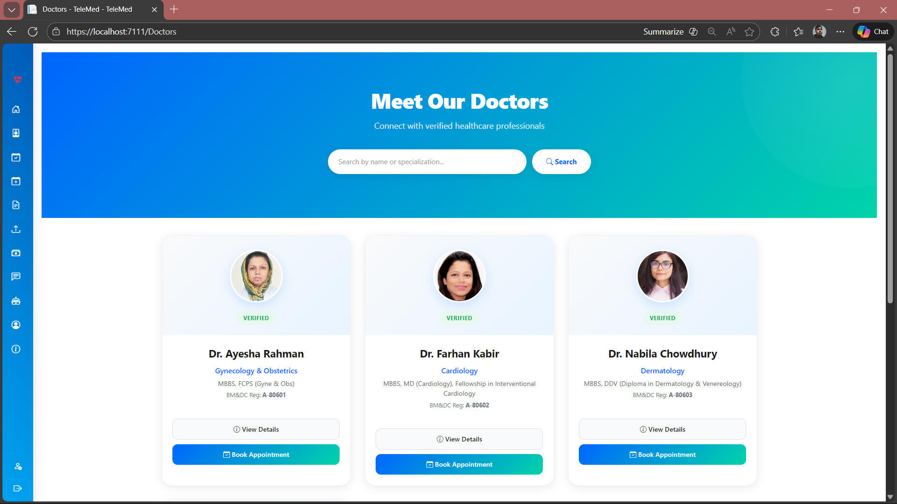
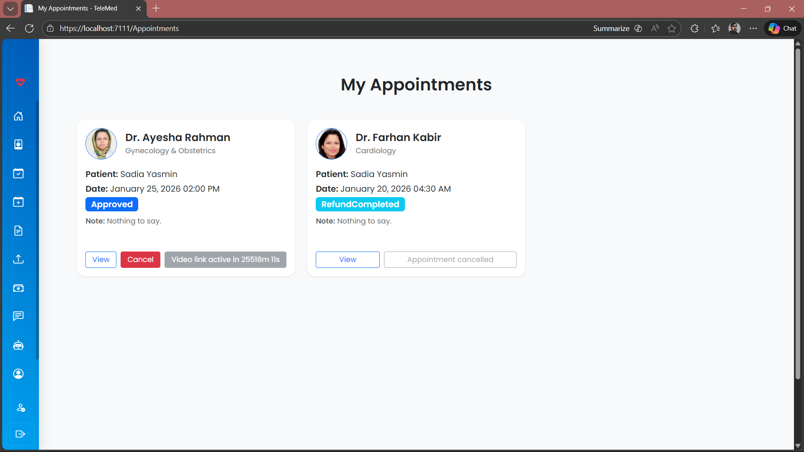

# 🩺 TeleMed – Online Healthcare Management System

**TeleMed** is a modern web-based telemedicine platform built with **ASP.NET Core MVC**.  
It connects doctors and patients for **virtual consultations**, enabling features like **online appointments, prescription management, video sessions**, and **role-based access control** for Admins, Doctors, and Patients.

---

---
## 📸 Screenshots

---

## 🚀 Features

### 👨‍⚕️ For Doctors
- Manage appointments and schedules
- Approve or reject patient bookings
- Conduct online consultations
- Upload, view, and update digital prescriptions
- View patient feedback and ratings
- View payment history
- Update profile information

### 🧑‍🤝‍🧑 For Patients
- Book and manage appointments
- Receive instant email confirmations
- Cancel appointments anytime (based on rules)
- Get refunds according to the refund policy
- Join virtual sessions with doctors
- View and download uploaded prescriptions
- Give feedback after consultations
- Download invoices as PDF
- Access profile and full appointment history
- Make payments through secure SSL payment gateway
- Chat with an integrated AI assistant

### 🧑‍💼 For Admins
- Manage doctors and patients
- Approve pending doctor registrations and profile update requests
- View reports and payment summaries
- Review patient feedback

### ⚡ System-Level Features
- Automatically generates professional PDF invoices
- Patients can download invoices anytime
- Email notifications for new appointments
- Email notifications for appointment cancellations
- Daily automated database backups
- Role-based authentication using ASP.NET Identity
- Secure and structured payment workflow
- Chatbot can suggest suitable doctors

---

## 🛠️ Tech Stack

| Category | Technologies |
|-----------|---------------|
| **Framework** | ASP.NET Core MVC 9 |
| **Frontend** | Razor Pages, Bootstrap 5, jQuery |
| **Database & ORM** | SQL Server, Entity Framework Core |
| **Authentication & Security** | ASP.NET Identity, Role-based Access Control, SSL-enabled payment flow |
| **Email Service** | SMTP-based email notifications |
| **Payment Gateway** | SSLCommerz (or your chosen SSL gateway) |
| **PDF Generator** | QuestPDF |
| **AI Assistant** | Chatbot integrated with project features |
| **Task Scheduling** | Background services for automated backups |
| **File Storage** | Local storage under wwwroot/uploads/prescriptions/ |
| **Deployment Ready** | Supports IIS / Cloud Hosting |

---

### ⚠️ Limitations
This project works well, but like any real system, it has boundaries. These help reviewers see that you understand tradeoffs.
- System currently depends on reliable internet access for most features.
- Payment testing may rely on sandbox mode instead of fully live production transactions.
- AI chatbot suggestions are supportive, not medically certified or expert-approved.
- Refund logic follows predefined rules and may not handle all real-world edge cases.
- Admin actions require manual review instead of fully automated workflows.
- Limited logging and monitoring for large scale production environments.
- Backups are basic and stored locally instead of using cloud-level redundancy.
- No mobile app version yet, only web-based.
- Role permissions are predefined and not configurable through UI.
- Performance not fully stress-tested for very high traffic.

---

## ⚙️ Installation & Setup

### 1️⃣ Clone the repository
    git clone https://github.com/infinityAbir/TelMed_System.git
    cd TeleMed
### 2️⃣ Open in Visual Studio
Open the .sln file in Visual Studio 2022 or later.
Make sure you have .NET 9 SDK installed.

### 3️⃣ Configure Database
Update your appsettings.json connection string if needed.
Run migrations and update the database:
      
      git clone https://github.com/infinityAbir/TelMed_System.git
      cd TeleMed
### 4️⃣ Run the Application
Press F5 or run:
     
      dotnet run
      
Visit https://localhost:7111 (or the port shown in console).

### 💳 Payment Gateway Configuration

Before using the online payment system, add your payment gateway keys to your **appsettings.json** file:

    "StripeSettings": {
      "PublishableKey": "YOUR_PUBLISHABLE_KEY_HERE",
      "SecretKey": "YOUR_SECRET_KEY_HERE"
    }
---
### 📧 Email Integration Setup

To enable automated emails (appointment confirmations, receipts, notifications), add your email configuration to **appsettings.json**:

    "EmailSettings": {
      "SenderEmail": "YOUR_EMAIL_ADDRESS_HERE",
      "AppPassword": "YOUR_APP_PASSWORD_HERE",
      "Host": "smtp.gmail.com",
      "Port": 587
    }
---
### 🤖 AI Chatbot Integration Setup

The chatbot assists patients and helps suggest doctors. It is not a medical expert and should not replace real consultation.

    "AI": {
      "GroqKey": "YOUR_API_KEY_HERE"
    }
---
👨‍💻 Author
Abir Hasan
